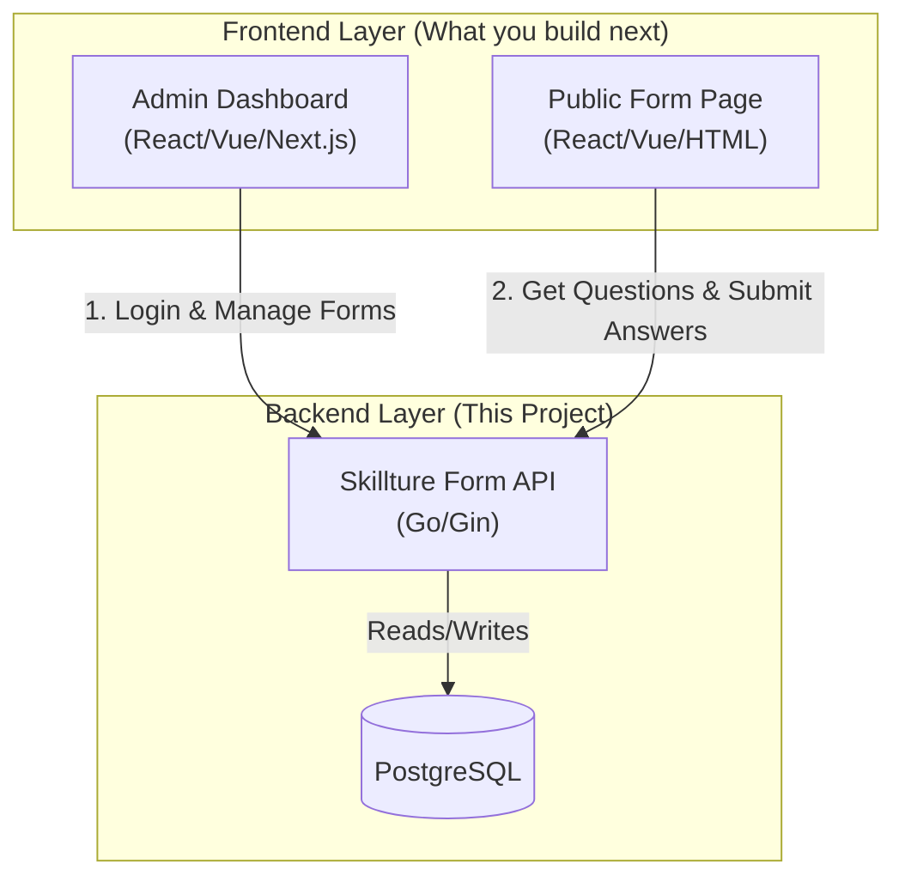

# System Architecture & Frontend Integration

## Is this a website?
**No, currently this application is a "Headless API".**

It provides the back-end logic, database storage, and security, but it does **not** have a visual user interface (HTML/CSS). It speaks purely in **JSON**.

## Can I make a website over it?
**Yes, absolutely!** This is exactly how modern web applications are built. You can build **two separate frontend applications** (or one large one) that communicate with this API.

### The Vision: A Dual-Interface System

You can build two distinct user experiences on top of this single API:

1.  **Admin Dashboard (Private)**
    *   **Who uses it?**: System Administrators.
    *   **Features**: Login, Create Forms, Edit Questions, View Responses.
    *   **API Endpoints Used**:
        *   `POST /admins/login`
        *   `GET /forms`
        *   `POST /forms` (Builder UI)
        *   `GET /forms/:id/responses` (Analysis UI)

2.  **User Form (Public)**
    *   **Who uses it?**: End-users / Respondents.
    *   **Features**: View the list of questions, Submit answers.
    *   **API Endpoints Used**:
        *   `GET /forms/:id/fields` (To render the form structure)
        *   `POST /responses` (To submit their answers)

## Architecture Diagram

## How it works

### Scenario: Admin creates a form
1.  Admin logs into your **Dashboard Website**.
2.  They click "Create Form".
3.  Your website sends a `POST /api/v1/forms` request to this API.
4.  The API saves it to the database.

### Scenario: User takes a survey
1.  User visits `your-site.com/forms/123`.
2.  Your website sends a `GET /api/v1/forms/123/fields` request to this API.
3.  The API returns the list of questions in JSON (e.g., `[{"label": "Name", "type": "text"}]`).
4.  Your website loops through that JSON and renders HTML inputs.
5.  User clicks "Submit".
6.  Your website sends a `POST /api/v1/responses` request to this API.
