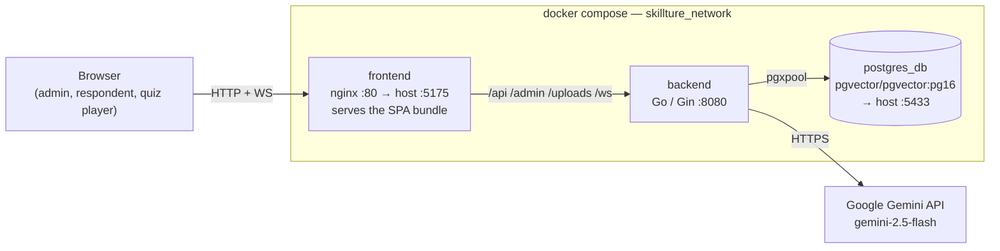
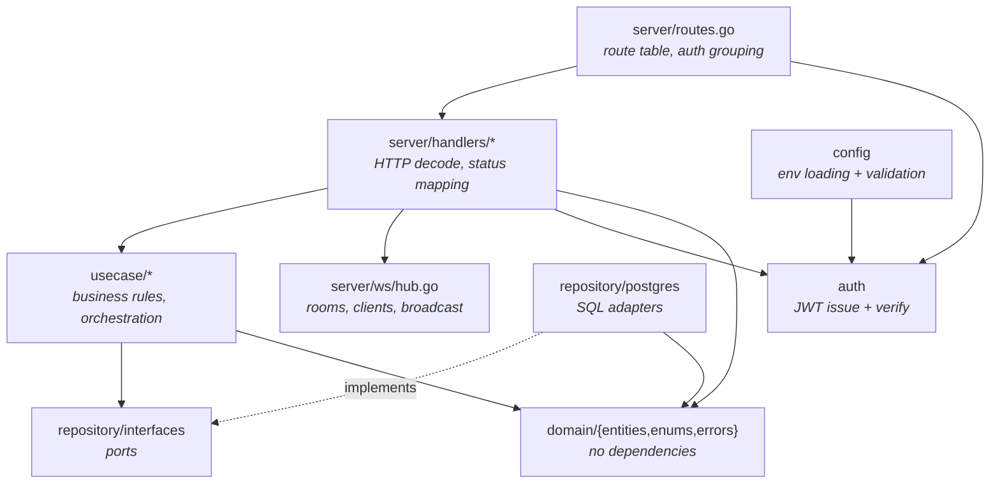
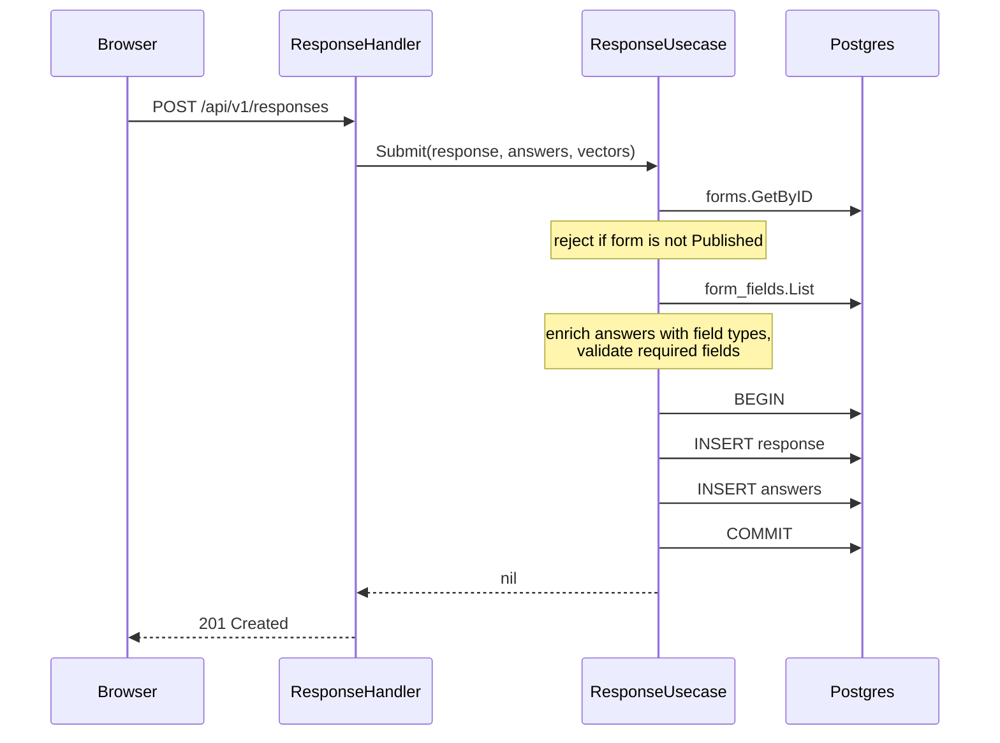
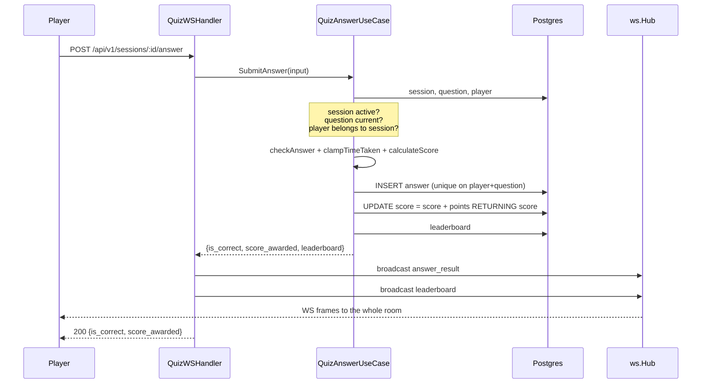
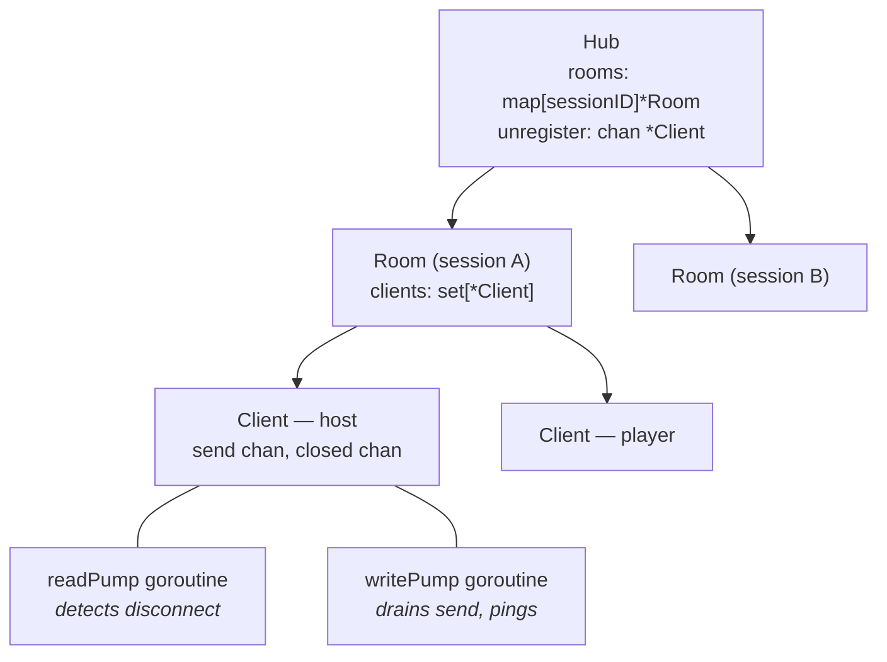
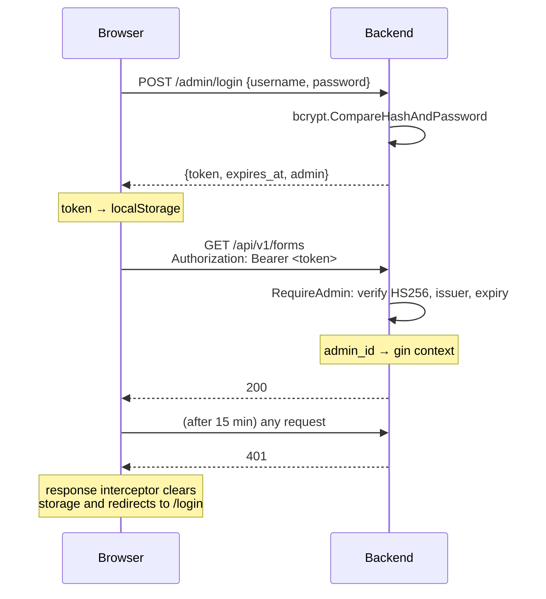
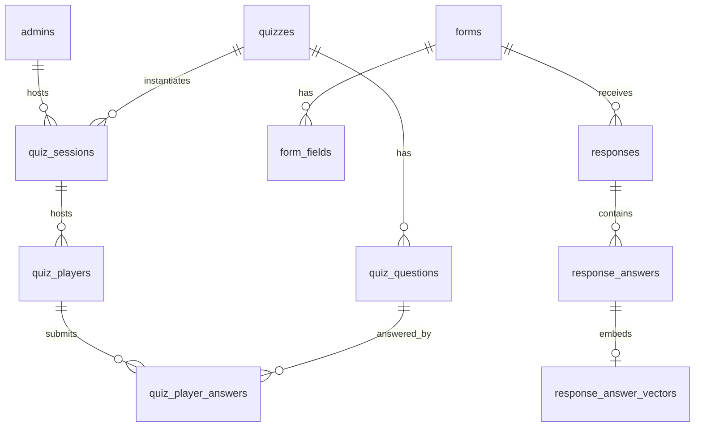
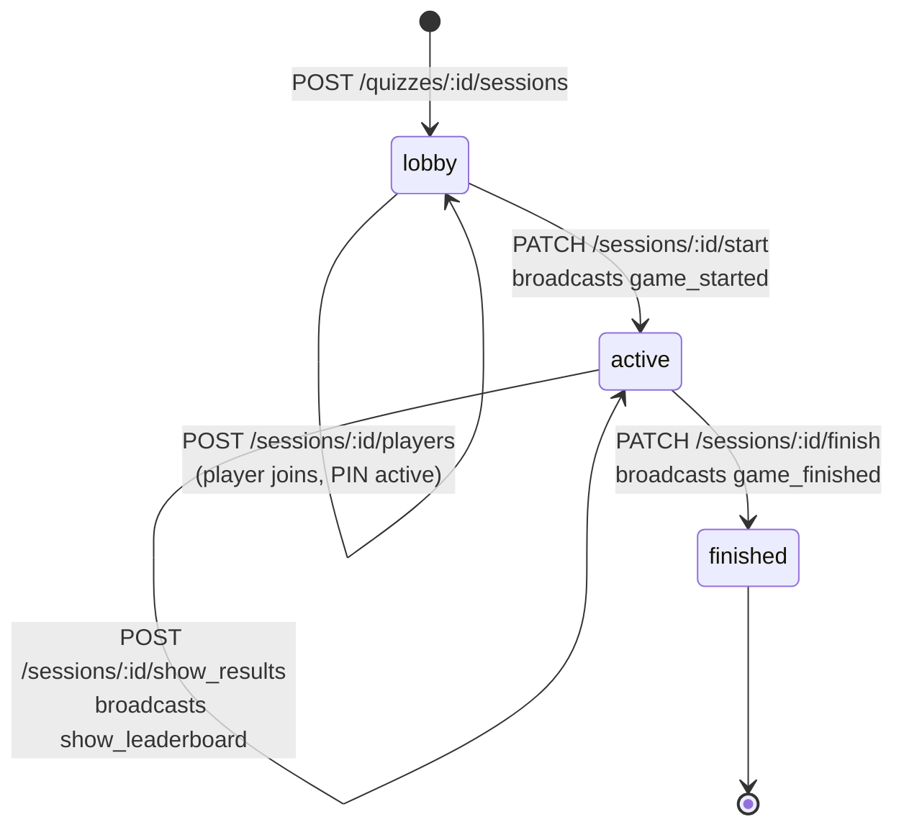

# Skillture — Architecture

How the system is put together, and why it is put together that way. For the list of
known defects see [`ISSUES.md`](ISSUES.md).

---

## 1. System map

```mermaid
flowchart LR
    Browser["Browser<br/>(admin, respondent, quiz player)"]

    subgraph Docker["docker compose — skillture_network"]
        Nginx["frontend<br/>nginx :80 → host :5175<br/>serves the SPA bundle"]
        API["backend<br/>Go / Gin :8080"]
        DB[("postgres_db<br/>pgvector/pgvector:pg16<br/>→ host :5433")]
    end

    Gemini["Google Gemini API<br/>gemini-2.5-flash"]

    Browser -->|"HTTP + WS"| Nginx
    Nginx -->|"/api /admin /uploads /ws"| API
    API -->|"pgxpool"| DB
    API -->|"HTTPS"| Gemini
```

The browser only ever talks to one origin. nginx serves the static bundle and reverse-proxies
everything else to the API, so the SPA uses relative URLs and needs no build-time
configuration. In development, the Vite dev server plays nginx's role via the proxy block in
`frontend/vite.config.ts`.

**Ports.** nginx is published on `5175`, the API on `8080`, Postgres on `5433`. `5173` is
the Vite dev-server default and only applies to `npm run dev`.

---

## 2. Backend layering

The Go code follows a clean-architecture split. Dependencies point inward only; nothing in
`domain` imports anything else in the project.

```mermaid
flowchart TD
    R["server/routes.go<br/><i>route table, auth grouping</i>"]
    H["server/handlers/*<br/><i>HTTP decode, status mapping</i>"]
    WS["server/ws/hub.go<br/><i>rooms, clients, broadcast</i>"]
    UC["usecase/*<br/><i>business rules, orchestration</i>"]
    RI["repository/interfaces<br/><i>ports</i>"]
    RP["repository/postgres<br/><i>SQL adapters</i>"]
    D["domain/{entities,enums,errors}<br/><i>no dependencies</i>"]
    A["auth<br/><i>JWT issue + verify</i>"]
    C["config<br/><i>env loading + validation</i>"]

    R --> H
    R --> A
    H --> UC
    H --> WS
    H --> A
    UC --> RI
    RP -.implements.-> RI
    UC --> D
    RP --> D
    H --> D
    C --> A
```

| Package | Responsibility |
|---|---|
| `domain/entities` | Structs with `db:` and `json:` tags, plus pure domain predicates (`IsActive`, `IsValid`). |
| `domain/enums` | Typed constants. **Note the split convention:** form/quiz/response statuses and field types are `int16`; quiz question type and quiz *session* status are strings. The frontend types mirror this exactly. |
| `domain/errors` | Sentinel errors. These are the vocabulary `handlers/errors.go` maps to HTTP status codes. |
| `repository/interfaces` | Port definitions. Consumed by usecases; never reference gin or pgx types in signatures. |
| `repository/postgres` | pgx implementations over a shared `BaseRepository` that owns query timeouts and transactions. |
| `usecase/*` | Business rules. Depends only on repository ports and the domain. |
| `server/handlers` | Request decoding, calling one usecase, mapping the result to a status code. |
| `server/ws` | In-memory WebSocket hub. |
| `auth` | JWT issuing and the `RequireAdmin` gin middleware. Its own package so both `server` and `server/handlers` can import it without a cycle. |
| `config` | Environment loading with per-section `Validate()`. `config.Load()` fails fast on a bad configuration. |

### Boot sequence — `cmd/api/main.go`

1. `config.Load()` — reads `.env`, validates. A `JWT_SECRET` shorter than 32 characters
   aborts startup here.
2. `database.New(cfg.Database)` — opens the pgx pool.
3. `postgres.NewBaseRepository(pool, cfg.Database.QueryTimeout)` — one shared base.
4. Eleven repositories, then usecases, then the Gemini service.
5. `auth.NewTokenIssuer(cfg.JWT)` and `ws.NewHub()` + `go hub.Run()`.
6. Nine handlers.
7. `gin.Default()`, `SetTrustedProxies`, `server.SetupMiddleware` (CORS), static `/uploads`.
8. `server.SetupRoutes(...)`.
9. `r.Run(addr)`.

### `BaseRepository`

Every repository composes `BaseRepository`, which provides four things:

- `Exec` / `Query` / `QueryRow` — each wraps the caller's context in `QueryTimeout`.
  `Query` keeps that context alive until the returned rows are closed, and `QueryRow` until
  `Scan` runs; both would otherwise cancel the context before the data was read.
- `WithTx(ctx, fn)` — begins a transaction, commits on `nil`, rolls back otherwise. The
  transaction is deliberately *not* scoped to the single-statement query timeout.

**Not-found convention:** every `GetByID` returns `(nil, nil)` when the row does not exist.
Callers must nil-check. Errors are reserved for genuine failures.

---

## 3. Request lifecycles

### Form submission — the transactional path

```mermaid
sequenceDiagram
    participant B as Browser
    participant H as ResponseHandler
    participant U as ResponseUsecase
    participant DB as Postgres

    B->>H: POST /api/v1/responses
    H->>U: Submit(response, answers, vectors)
    U->>DB: forms.GetByID
    Note over U: reject if form is not Published
    U->>DB: form_fields.List
    Note over U: enrich answers with field types,<br/>validate required fields
    U->>DB: BEGIN
    U->>DB: INSERT response
    U->>DB: INSERT answers
    U->>DB: COMMIT
    U-->>H: nil
    H-->>B: 201 Created
```

This is the only usecase that spans a transaction. Everything else performs single
statements.

### Quiz answer — REST in, WebSocket out

The game is driven entirely by REST calls from the host. The WebSocket carries
server→client events only; inbound frames are read (to detect disconnects) and discarded.

```mermaid
sequenceDiagram
    participant P as Player
    participant H as QuizWSHandler
    participant U as QuizAnswerUseCase
    participant DB as Postgres
    participant Hub as ws.Hub

    P->>H: POST /api/v1/sessions/:id/answer
    H->>U: SubmitAnswer(input)
    U->>DB: session, question, player
    Note over U: session active?<br/>question current?<br/>player belongs to session?
    U->>U: checkAnswer + clampTimeTaken + calculateScore
    U->>DB: INSERT answer (unique on player+question)
    U->>DB: UPDATE score = score + points RETURNING score
    U->>DB: leaderboard
    U-->>H: {is_correct, score_awarded, leaderboard}
    H->>Hub: broadcast answer_result
    H->>Hub: broadcast leaderboard
    Hub-->>P: WS frames to the whole room
    H-->>P: 200 {is_correct, score_awarded}
```

**Scoring.** `score = basePoints × (0.5 + 0.5 × speedRatio)`, where
`speedRatio = 1 − timeTaken / timeLimit`. A correct answer always earns at least half the
base points. `time_taken_ms` is measured in the browser and therefore untrusted, so
`clampTimeTaken` bounds it to `[0, timeLimit]` before scoring.

---

## 4. WebSocket model

```mermaid
flowchart TD
    Hub["Hub<br/>rooms: map[sessionID]*Room<br/>unregister: chan *Client"]
    R1["Room (session A)<br/>clients: set[*Client]"]
    R2["Room (session B)"]
    C1["Client — host<br/>send chan, closed chan"]
    C2["Client — player"]
    RP["readPump goroutine<br/><i>detects disconnect</i>"]
    WP["writePump goroutine<br/><i>drains send, pings</i>"]

    Hub --> R1
    Hub --> R2
    R1 --> C1
    R1 --> C2
    C1 --- RP
    C1 --- WP
```

- One `Hub` per process, one `Room` per live session, one `Client` per connection, two
  goroutines per client.
- **Registration is synchronous.** `RegisterClient` creates the room and adds the client
  before returning, so a handler can broadcast on the next line and be sure the new client
  is in the room.
- **Unregistration is asynchronous.** `readPump` pushes onto the `unregister` channel;
  `Hub.Run` removes the client, closes its send channel exactly once via `sync.Once`, and
  deletes the room if it is now empty.
- `Client.Send` is non-blocking and drops the message if the 64-slot buffer is full. It is
  a no-op once the client is closed.
- **Single-instance only.** Rooms live in process memory, so running two backend replicas
  splits players across hubs. Horizontal scaling needs a shared broker (see `ISSUES.md`).

### Message types (server → client)

| Type | Sent when | Payload |
|---|---|---|
| `lobby_snapshot` | A player connects | `{status, current_question_id, players}` |
| `player_joined` | A player connects | `{player_id, name}` |
| `game_started` | Host starts the session | — |
| `question` | Host advances | `PublicQuizQuestion` — **`correct_answer` stripped** |
| `answer_result` | Any player answers | `{player_id}` |
| `leaderboard` | Any player answers | `[]QuizPlayer` |
| `show_leaderboard` | Host publishes results | `[]QuizPlayer` |
| `game_finished` | Host finishes the session | `[]QuizPlayer` |

The host socket authenticates with `?token=<jwt>`; a browser cannot set an `Authorization`
header on a WebSocket handshake. Player sockets are unauthenticated but the handler checks
that `player_id` actually belongs to the session in the URL.

---

## 5. Authentication

```mermaid
sequenceDiagram
    participant B as Browser
    participant API as Backend

    B->>API: POST /admin/login {username, password}
    API->>API: bcrypt.CompareHashAndPassword
    API-->>B: {token, expires_at, admin}
    Note over B: token → localStorage
    B->>API: GET /api/v1/forms<br/>Authorization: Bearer <token>
    API->>API: RequireAdmin: verify HS256, issuer, expiry
    Note over API: admin_id → gin context
    API-->>B: 200
    B->>API: (after 15 min) any request
    API-->>B: 401
    Note over B: response interceptor clears<br/>storage and redirects to /login
```

- HS256, signed with `JWT_SECRET`, issuer `JWT_ISSUER`, 15-minute access lifetime
  (`JWT_ACCESS_EXPIRE_MIN`). The verifier pins the algorithm, so an `alg: none` token is
  rejected.
- Passwords are bcrypt at `BCRYPT_COST` (default 12).
- There is **no refresh token flow yet** — the token simply expires and the user logs in
  again.
- `RequireAdmin` puts the admin's UUID in the gin context. `CreateSession` reads it from
  there rather than trusting a `host_id` in the body.

### Route protection

| Group | Auth | Why |
|---|---|---|
| `POST /admin/login` | — | Entry point. |
| `/admin/me`, `/admin/create`, `/admin/list`, `/admin/delete/:id` | Required | Account management. |
| `GET /api/v1/homepage`, `/homepage/images` | — | Public landing page. |
| `GET /api/v1/forms/:id`, `/forms/:id/fields`, `POST /responses` | — | Respondents open a form by link; they have no accounts. |
| `GET /sessions/pin/:pin`, `GET /sessions/:id`, `GET /sessions/:id/leaderboard`, `POST /sessions/:id/players`, `POST /sessions/:id/answer` | — | Quiz players have no accounts. |
| Everything else under `/api/v1` | Required | Form/quiz CRUD, responses, CMS writes, session state machine, AI report. |
| `GET /ws/sessions/:id/host` | Token in query | Host event stream. |
| `GET /ws/sessions/:id/join` | Player-session ownership check | Player event stream. |

---

## 6. Data model

Thirteen tables, created by the migrations in
`backend/internal/database/migrations/`.

Migrations are embedded in the backend binary with `go:embed` and applied on boot by
`database.Migrate`, under a Postgres advisory lock so two replicas starting together
cannot both apply the same file. Each runs in its own transaction; a failure leaves the
schema at the last complete version and the process exits rather than serving requests
against a schema the code does not expect.

They are forward-only — there are no `.down.sql` files. Rolling a production schema
backwards is rarely what is wanted, and a half-applied "down" is worse than the change
it undoes. To reverse something, write the next migration. Applied versions are recorded
in `schema_migrations`.

```mermaid
erDiagram
    admins ||--o{ quiz_sessions : hosts
    forms ||--o{ form_fields : has
    forms ||--o{ responses : receives
    responses ||--o{ response_answers : contains
    response_answers ||--o| response_answer_vectors : embeds
    quizzes ||--o{ quiz_questions : has
    quizzes ||--o{ quiz_sessions : instantiates
    quiz_sessions ||--o{ quiz_players : hosts
    quiz_players ||--o{ quiz_player_answers : submits
    quiz_questions ||--o{ quiz_player_answers : answered_by
```

Plus two standalone CMS tables: `homepage_content` (single row) and `homepage_images`.

**Conventions.**

- All primary keys are UUIDs generated by the application, except the seeded admin.
- Multilingual text is JSONB: `{"en": "...", "ar": "..."}`. `title`, `description`,
  `label`, `placeholder`, `help_text`, `options`, `question` and `correct_answer` are all
  JSONB — which is why filtering on a title needs `title->>'en' ILIKE`, not `title ILIKE`.
- Foreign keys cascade on delete, except `quiz_sessions.current_question_id`, which is
  `SET NULL`.
- `uq_player_question_answer UNIQUE (player_id, question_id)` is the authoritative
  double-answer guard; the application's pre-check is only a fast path.
- `uq_quiz_players_session_name` makes nicknames unique per session.
- `response_answer_vectors.embedding` is `vector(1536)` with an HNSW index. **This table is
  currently never written to** — see `ISSUES.md`.

### Status enums

These are the most error-prone part of the wire contract, because they are not consistent
with each other.

| Column | Go type | Encoding | Values |
|---|---|---|---|
| `forms.status` | `enums.FormStatus` | `int16` | 0 draft, 1 published, 2 closed |
| `quizzes.status` | `enums.QuizStatus` | `int16` | 0 draft, 1 active, 2 archived |
| `responses.status` | `enums.ResponseStatus` | `int16` | 0 pending, 1 submitted, 2 reviewed |
| `form_fields.type` | `enums.FieldType` | `int16` | 1–8: text, textarea, number, email, select, radio, checkbox, date |
| `quiz_questions.type` | `enums.QuizQuestionType` | `string` | `mcq`, `tf`, `short` |
| `quiz_sessions.status` | `enums.QuizSessionStatus` | `string` | `lobby`, `active`, `finished` |

`frontend/src/api/types.ts` mirrors this table. Keeping the two in sync is the single
highest-value maintenance rule in this codebase — every historical mismatch produced a
silent, wrong-looking UI rather than an error.

### Session state machine

```mermaid
stateDiagram-v2
    [*] --> lobby: POST /quizzes/:id/sessions
    lobby --> lobby: POST /sessions/:id/players<br/>(player joins, PIN active)
    lobby --> active: PATCH /sessions/:id/start<br/>broadcasts game_started
    active --> active: PATCH /sessions/:id/advance<br/>broadcasts question
    active --> active: POST /sessions/:id/answer<br/>broadcasts answer_result + leaderboard
    active --> active: POST /sessions/:id/show_results<br/>broadcasts show_leaderboard
    active --> finished: PATCH /sessions/:id/finish<br/>broadcasts game_finished
    finished --> [*]
```

Answers are accepted only while the session is `active` **and** the submitted
`question_id` equals the session's `current_question_id`.

---

## 7. Frontend

### Routes — `src/App.tsx`

| Path | Access | Page |
|---|---|---|
| `/` | Public | `HomePage` (CMS-driven landing) |
| `/login` | Public | `Login`; redirects to the dashboard if already authenticated |
| `/preview/form/:id` | Public | `FormPreview` — the respondent-facing form |
| `/quiz/:id` | Public | `QuizJoinHandler` — polls for an active session |
| `/play`, `/play/:sessionId` | Public | `PlayerJoin`, `PlayerLiveBoard` |
| `/host/lobby/:sessionId`, `/host/live/:sessionId` | Public route, authenticated API | `GameLobby`, `HostLiveBoard` |
| `/admin/*` | Guarded | `MainLayout` + dashboard, forms, quizzes, builders, CMS editor |

`/admin/*` is guarded by a redirect in `MainLayout.tsx`. That is a UX affordance only —
the real boundary is `RequireAdmin` on the server.

### State and data access

- `context/AuthStore.ts` — zustand, hydrated from `localStorage` at creation.
- `context/ToastStore.ts` — zustand, transient notifications.
- `api/client.ts` — a single axios instance. A request interceptor attaches the bearer
  token; a response interceptor clears storage and redirects on 401.
- `api/ws.ts` — the only place WebSocket URLs are built (`hostSocketUrl`,
  `playerSocketUrl`).
- `api/types.ts` — wire types, mirroring the Go entities.

### Styling

Tailwind v4 via `@tailwindcss/vite`, configured through `@theme` tokens in `src/index.css`
(v4 needs no `tailwind.config.js`). In practice the codebase mixes Tailwind utilities,
arbitrary values like `bg-[#0ABFBC]`, and inline `style` objects; the brand colour is
hardcoded in roughly 90 places rather than read from the theme token. Cleaning this up is
tracked in `ISSUES.md`.
